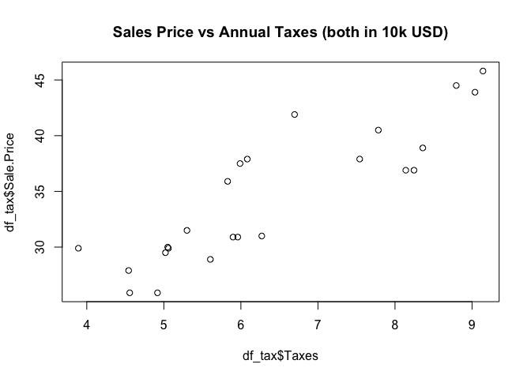
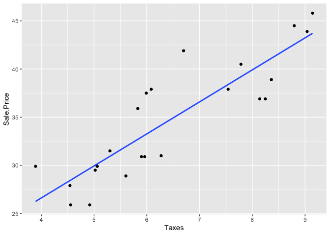

    library(ggplot2)

# Part 1

## Read Data and Summary

    head -5 ./6414\-HW2\-taxes.csv

    ## "The following data are sale price, y ($10,000) and taxes, x ($10,000). ",
    ## Sale Price,Taxes
    ## 25.9,4.9176
    ## 29.5,5.0208
    ## 27.9,4.5429

Since the first line does not have data we should skip it, also both the
data columns are in 10k USD scale.

    df_tax = read.table(file ="./6414-HW2-taxes.csv",skip=1, sep=",",header=TRUE)
    head(df_tax)

    ##   Sale.Price  Taxes
    ## 1       25.9 4.9176
    ## 2       29.5 5.0208
    ## 3       27.9 4.5429
    ## 4       25.9 4.5573
    ## 5       29.9 5.0597
    ## 6       29.9 3.8910

    dim(df_tax)

    ## [1] 26  2

    summary(df_tax)

    ##    Sale.Price        Taxes      
    ##  Min.   :25.90   Min.   :3.891  
    ##  1st Qu.:29.90   1st Qu.:5.057  
    ##  Median :33.70   Median :5.974  
    ##  Mean   :34.61   Mean   :6.405  
    ##  3rd Qu.:38.15   3rd Qu.:7.873  
    ##  Max.   :45.80   Max.   :9.142  
    ##  NA's   :2       NA's   :2

    df_tax = df_tax[1:(nrow(df_tax)-2),] #Remove last two empty rows
    dim(df_tax)

    ## [1] 24  2

## Question 1: Scatter Plot

    plot(x=df_tax$Taxes, y=df_tax$Sale.Price, type ="p",main = "Sales Price vs Annual Taxes (both in 10k USD)")

$\color{blue}{\text{From the above plot, a linear realationship between Sales Price and Taxes is apparent.}}$

$\color{blue}{\text{The strength of the linear realtionship can also be tested with corealtion between x and y.}}$

    print (paste("Corealtion on full data:",round(cor(df_tax$Taxes,df_tax$Sale.Price),2)))

    ## [1] "Corealtion on full data: 0.88"

$\color{blue}{\text{A corelation of 0.88 is pretty significant and supports strong linear realtionship between x and y.}}$

## Question 2: Fit SLR

    #Fit SLR
    model0 <- lm(Sale.Price ~ Taxes, data = df_tax)
    model0

    ## 
    ## Call:
    ## lm(formula = Sale.Price ~ Taxes, data = df_tax)
    ## 
    ## Coefficients:
    ## (Intercept)        Taxes  
    ##      13.320        3.324

    #Superpositioning regression line on 
    ggplot(df_tax, aes(Taxes, Sale.Price)) + #aes(x,y)
      geom_point() +
      stat_smooth(method = lm, se = FALSE)

    ## `geom_smooth()` using formula 'y ~ x'

$$
From\\ above, we\\ have:\\\\
\hat{\beta}\_0:= Intecept = 13.320,\\\\
\hat{\beta}\_1:=Slope = 3.324,\\ and\\\\
\hat{y} = \hat{\beta}\_0 +\hat{\beta}\_1 \* x = 13.320 + 3.324 \*x
$$

## Question 3: Meaning of beta1 (*β̂*1):

*β̂*1 implies the slope of the SLR line we have fit to the
data. In other words, it tells us, the change recorded in y (on average)
for every one unit of change in x.

$\color{blue}{\text{In this case, this implies for every 10k USD change in Taxes, the Price goies up by 3,324 USD (on average).}}$

## Question 4: Meaning of beta0 (*β̂*0):

*β̂*0 implies the predicted value of y given x is zero.
\\\\$\color{blue}{\text{In this case, this implies for 0 USD in taxes (let's assume), the the expected prices is 13,320 USD}}$

## Question 5: value of s, *s*2 and SSE:

s and s^2

    s_squared = sum(sapply(model0["residuals"], function(x) x^2))/(nrow(df_tax)-2)
    s_squared

    ## [1] 8.767753

    s_squared^0.5

    ## [1] 2.961039

### SSE from fitted values

*S**S**E* = ∑*i* ∈ *a**l**l* *d**a**t**a* *p**o**i**n**t**s*(\[*y**i*−*ŷ**i*\]2)

    y_hat = fitted(model0)
    y_act = df_tax$Sale.Price

    sse = sum((y_act - y_hat)^2)
    sse

    ## [1] 192.8906

    sse/(nrow(df_tax)-2)

    ## [1] 8.767753

# Part 2

## Question 6: Least Square Estimate of beta0, beta1:

$$
\hat{\beta}\_1 = \frac{(\sum\_i{x\_iy\_i}) - n\overline{x}\overline{y}}{\sum\_i{{x\_i}^2} - n\overline{x}^2},\\\\
we\\ have:\\\\
\sum\_i{x\_iy\_i} = 1697.8,\\\\
n\overline{x}\overline{y} = n \* \frac{\sum\_i{x\_i}}{n} \* \frac{\sum\_i{y\_i}}{n},\\\\
\sum\_i{{x\_i}^2} = 157.42,\\\\
n\overline{x}^2 = n \* \frac{\sum\_i{x\_i}}{n} = \sum\_i{x\_i} = 14\*(43/14)^2
$$

    num = 1697.8 - (14 * (43/14) * (572/14))
    num

    ## [1] -59.05714

    denom = 157.42 - (14*(43/14)^2)
    denom

    ## [1] 25.34857

    beta1 = num/denom
    beta1

    ## [1] -2.329802

$$
\hat{\beta}\_0 = \overline{y} - \hat{\beta}\_1\overline{x}
$$

    beta0 = (572/14) - beta1*(43/14)
    beta0

    ## [1] 48.01296

## Question 7: Calculate SSE

$$
SSE = SS\_{yy} - \hat{\beta}\_1SS\_{xy},\\\\
SS\_{yy} = \sum\_i{(y\_i - \overline{y})^2} = \sum\_i{y\_i}^2 - n\overline{y}^2,\\\\
SS\_{xy} = (\sum\_i{x\_iy\_i}) - n\overline{x}\overline{y}
$$

    SS_yy = 23530 - 14 *((572/14))^2
    SS_xy = num #from ques7
    SSE = SS_yy - beta1 * SS_xy
    sigma2 = SSE/(14-2)
    sigma2

    ## [1] 1.843572

## Question 8: y for x =3.7

    y_act = 46.1
    y_hat = beta0 + beta1 * 3.7
    residual = y_act - y_hat
    y_hat

    ## [1] 39.3927

    residual

    ## [1] 6.707304
